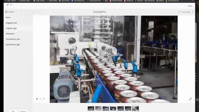

# [!DNL Experience Manager] 스킬 빌더 레코딩

기술 자료를 구축하고 Adobe [!DNL Experience Manager]에 대한 투자를 극대화하도록 설계된 녹화된 웨비나를 갖춘 Adobe [!DNL Experience Manager] Skill Builder 녹화 홈에 오신 것을 환영합니다.

## 새로운 기능

<table>
<tr>
  <td>
    
    

      <a href="https://experienceleague.adobe.com/ko/docs/experience-manager-skill-builder/skill-builder/for-2020/asset-link">
    <strong>[!DNL Asset Link]</strong>
    </a>
    

    

    <em>[!DNL Asset Link]은(는) Adobe Creative Cloud에 대한 기본 연결입니다.</em>
    

  </td>
  <td>
    
    

    <a href="https://experienceleague.adobe.com/ko/docs/experience-manager-skill-builder/skill-builder/for-2020/brand-portal">
    <strong>Brand Portal</strong>
    </a>
    

    

    <em>내부 및 외부 팀과의 쉬운 자산 공유</em>
    

  </td>
  <td>
    
     

      <a href="https://experienceleague.adobe.com/ko/docs/experience-manager-skill-builder/skill-builder/for-2020/dynamic-media">
        <strong>[!DNL Dynamic Media]</strong>
      </a>
    

    

    <em>모든 채널 및 화면에 대한 에셋 출력을 자동화합니다.</em>
    

  </td>
</tr>
</table>

>[!TIP]
>
>**이전 Skill Builder 이벤트의 녹화본을 보려면 왼쪽에 있는 탐색을 확인하십시오**.
